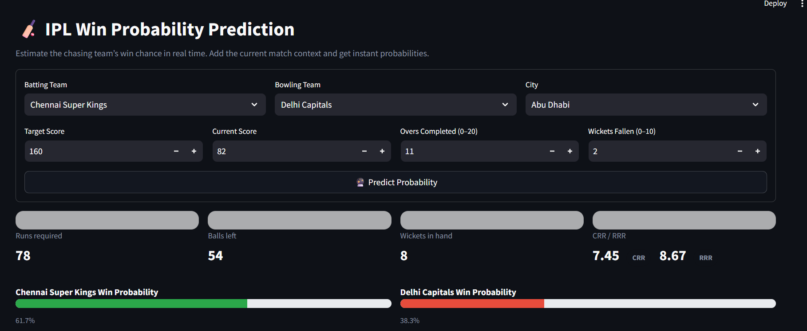
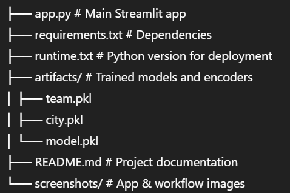
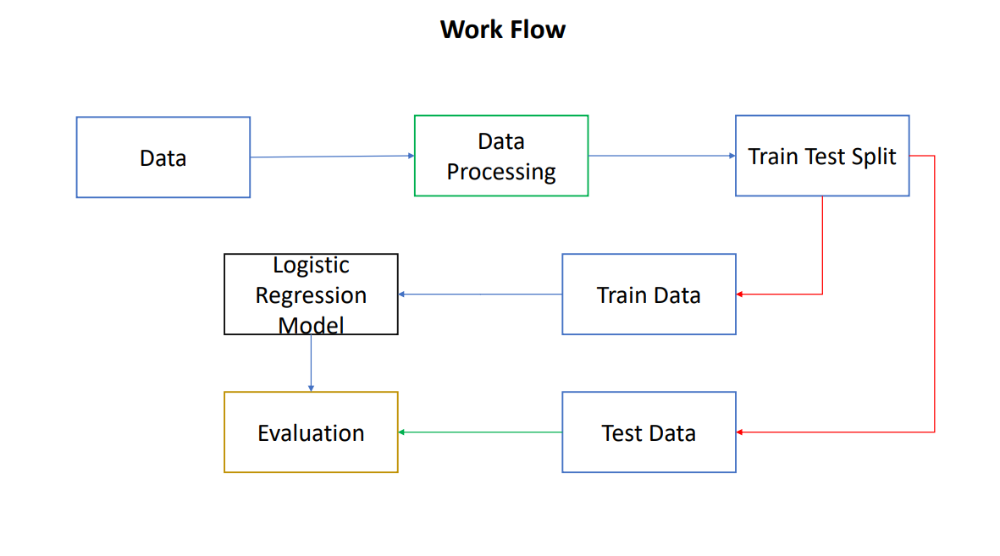

# 🏏 IPL Win Probability Prediction

A Streamlit web app that predicts the probability of a team winning an IPL match during a run chase.  
The model is trained on IPL match data and uses **Logistic Regression** to estimate win chances based on the match situation.

<p align="center">
  
</p>

---

## 📊 Dataset
We used the [IPL Dataset on Kaggle](https://www.kaggle.com/datasets/ramjidoolla/ipl-data-set).

---

## ⚙️ Features
- Select **Batting Team**, **Bowling Team**, and **City**.
- Input current match details:
  - 🎯 Target score  
  - 🏏 Current score  
  - ⏱️ Overs completed  
  - ❌ Wickets fallen
- Real-time calculation of:
  - Runs required, balls left, wickets in hand  
  - Current Run Rate (CRR) and Required Run Rate (RRR)  
  - Win/Loss probability (%)  
- Clean UI with progress bars and KPI cards.  

---

## 🛠️ Tech Stack
- **Python 3.11**
- **Streamlit** for web app
- **Pandas / Numpy** for data handling
- **Scikit-learn** (Logistic Regression model)

---
## 📂 Project Structure
<p align="center">
  
</p>


---

## 🔄 Workflow

<p align="center">
  
</p>

### Steps:
1. **Data Collection**  
   Collect IPL match data including runs, wickets, overs, and venue.  

2. **Data Processing**  
   Clean and preprocess the dataset (handling nulls, encoding categorical features like teams & cities).  

3. **Train-Test Split**  
   Divide the dataset into training and testing subsets for evaluation.  

4. **Model Training**  
   Train a **Logistic Regression model** on historical IPL data to predict win probability.  

5. **Evaluation**  
   Evaluate the model using accuracy, log-loss, and probability calibration.  

6. **Deployment**  
   Integrate the trained model into a **Streamlit Web App** for real-time probability predictions.  

---

## Future Improvements

- Add support for more ML models (Random Forest, XGBoost).
- Introduce ball-by-ball granularity (overs + balls instead of integer overs).
- Include team logos and dynamic themes for a richer UI.
- Optimize UI for mobile devices.
## 🚀 Run Locally
Clone the repo and install dependencies:

```bash
git clone https://github.com/<your-username>/<your-repo>.git
cd <your-repo>

# create virtual environment (recommended)
python -m venv .venv
source .venv/bin/activate   # (Linux/Mac)
.venv\Scripts\activate      # (Windows)


# install dependencies
pip install -r requirements.txt

---

# run the app
streamlit run app.py
